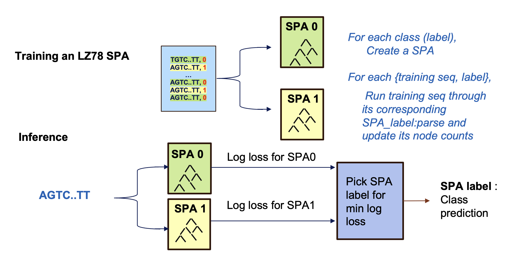
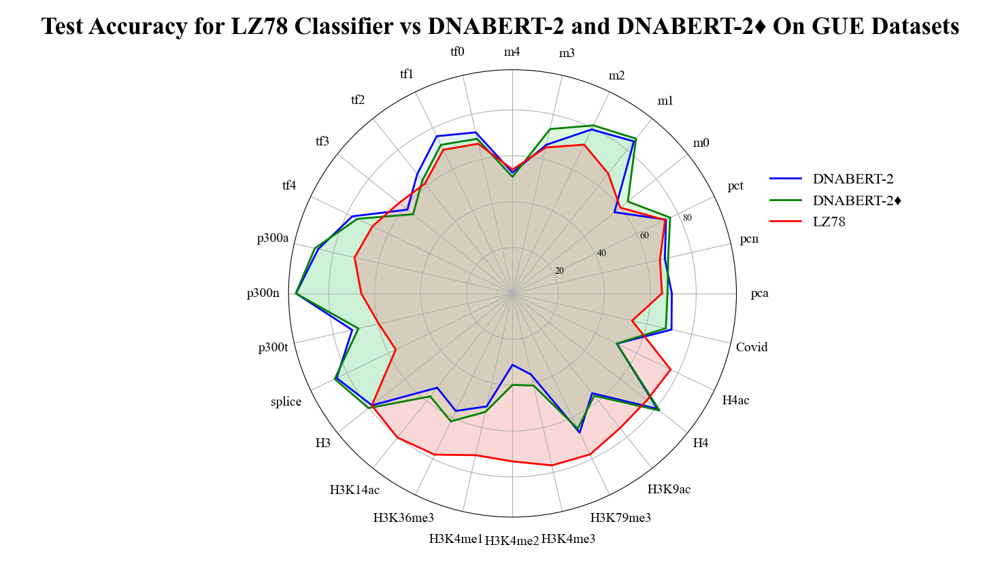
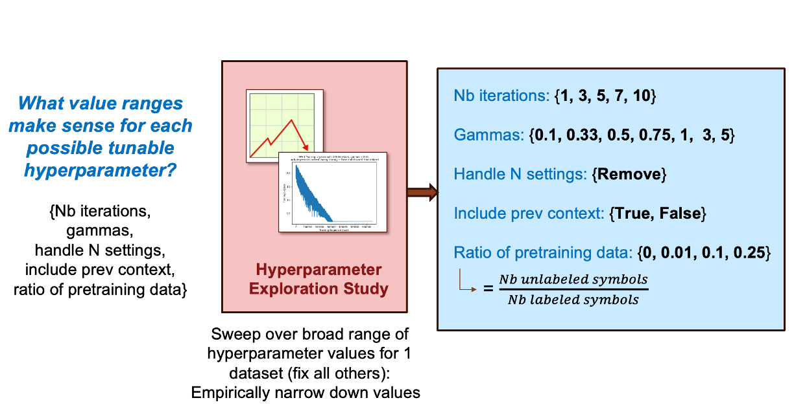
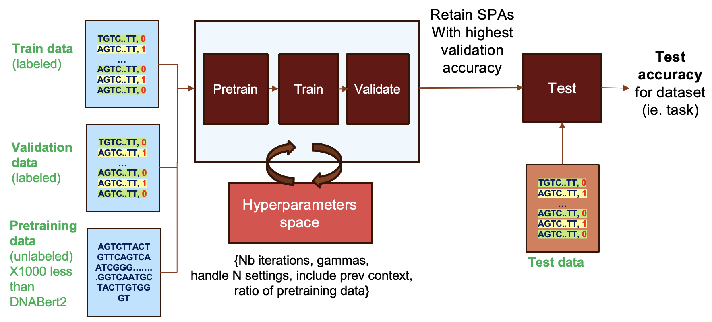

# Lossless Compression (LZ78) for Genomic Data Classification


Efficient and accurate DNA sequence classification is a crucial task in genomic data analysis. In this work, we propose a lossless compression approach to DNA classification, as a lightweight alternative to computationally intensive state-of-the-art models like DNABERT-2. Leveraging the equivalence between data compression and sequential probability assignments from information theory, we construct an LZ78 classifier and optimize its performance through hyperparameter tuning. 
Experimental results on 28 datasets from the Genomic Understanding Evaluation (GUE) suite demonstrate competitive results while drastically reducing computational costs. Unlike DNABert2, which was trained on tens of GBs of unlabeled data for 14 days on 8 NVIDIA RTX 2080Ti GPUs,  our LZ78 classifier is capable of training in under 5 hours on a standard CPU using a fraction of the training data. It also offers up to 5072× speedup in inference time and a dramatic decrease in training memory. These results highlight the potential of the LZ78 algorithm for scalable and efficient genomic data classification, particularly in resource-constrained environments. 
Additionally, we open-source a streamlined pipeline to enable further exploration of compression-based classification for genomics and beyond. Future work aims to enhance its robustness and extend its applicability to more complex genomic tasks.

More details can be found in our paper (BiorXiv)

<p align="center">
    
</p>

<p align="center">
    
</p>


## Setup
Clone the repository and follow the Setup instructions detailed on the [LZ78 SPA Codebase](https://github.com/NSagan271/lz78_rust).

## Training

Our LZ78-based classifier optimizes several hyperparameters that impact DNA classification accuracy. Five key hyperparameters were considered, including the Dirichlet parameter, context inclusion, number of epochs, unlabeled-to-labeled data ratio, and nucleotide placeholder handling. To efficiently explore hyperparameter combinations, we conducted a Hyperparameter Exploration Study to determine reasonable value ranges while maintaining computational efficiency. Although we suggest hyperparameter values that we found to be effective, the hyperparameter values used for the training sweep can be configured by the user. The final model selection follows a conventional AI framework, where classifiers are pre-trained, trained, validated, and the best-performing model is used for test data classification.

<p align="center">
    
</p>

<p align="center">
    
</p>

The Train.py script is used to run the pre-train, train, validate, test framework for the LZ78-based classifier for a given dataset.
The framework is highly configurable and outputs a detailed report including accuracy numbers and time/memory profiling.

Inputs:
- Labeled dataset path
- Unlabeled data for the optional pre-training phase
- Hyperparameter values to consider for the hyperparameter sweep


Outputs:
- Detailed printed report including: 
    * Validation accuracy for each combination of hyperparameters tested
    * Hyperparameter Combination producing the highest validation accuracy
    * Test accuracy (on test dataset) of the best SPAs
    * Depth of the trees corresponding to the best SPAs
    * Computational metrics
- Best SPAs (highest validation accuracy) saved as .bin files to be used for inference or further analysis.

```sh
# Example Usage of Train.py
python Train.py -dataset_folder GUE/mouse/0 -pretrain_file dnabert_2_pretrain/dev.txt --include_prev_context "{True, False}" --gamma "{0.1, 0.33, 0.5, 0.75, 1, 3, 5}" --nb_train_iterations "{1, 3, 5, 7, 10}" --ratio_pretrain_train "{0, 0.01, 0.1, 0.25}" --handle_n_setting "{remove}" > output_mouse0.txt 2>&1
```


## Inference
The Inference.py script uses trained SPAs to perform inference on a test dataset and report test accuracy.
The script can be easily modified to perform inference on a single sequence.

```sh
# Example Usage of Inference.py
python Inference.py --dataset Trained_SPAs/mouse_0 --dataset_test_csv GUE/mouse/0/test.csv --nb_classes 2
```

## Team
This project was developed by Yasmine Omri, Naomi Sagan, Eugene Min, and Tsachy Weissman at Stanford University.

## Acknowledgments
This project builds on ideas from Naomi Sagan and Tsachy Weissman's paper and codebase on LZ78 Sequential Probability Assignments:
- [LZ78 SPA Paper](https://arxiv.org/abs/2410.06589)
- [LZ78 SPA Codebase](https://github.com/NSagan271/lz78_rust)

This project uses the Genomic Understanding Evaluation benchmark suite, developed and generously open-sourced by the DNABERT-2 team.
- [DNABERT-2 Repository](https://github.com/MAGICS-LAB/DNABERT_2)