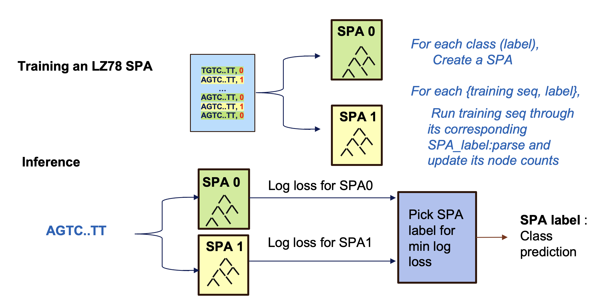
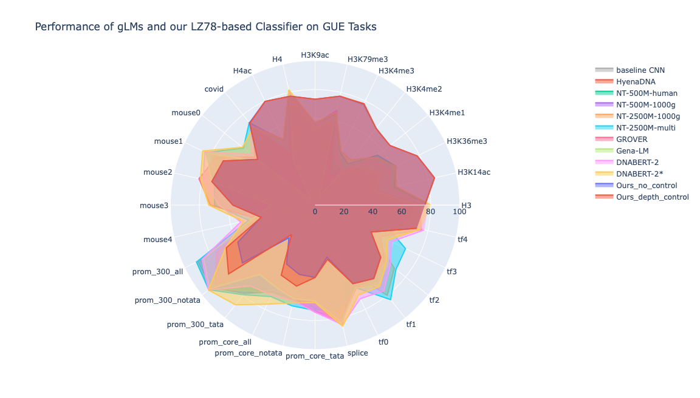
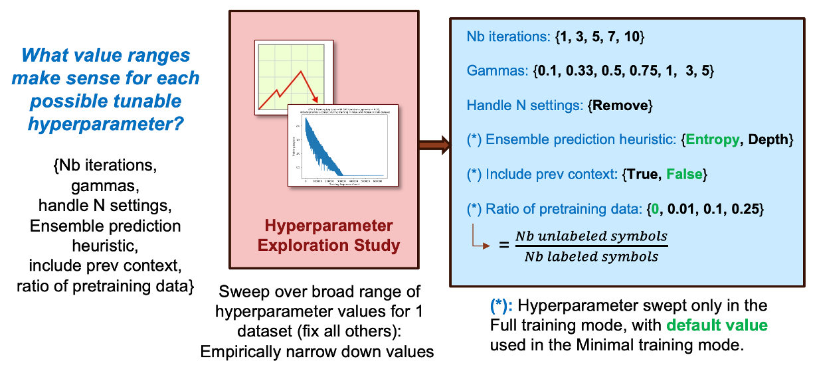
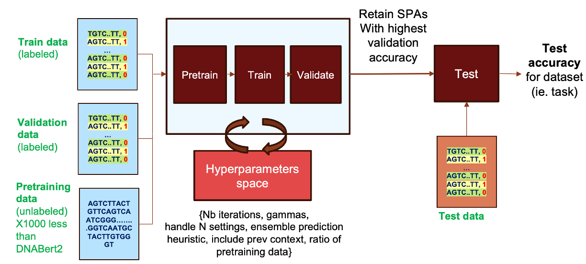

# Genomic Data Classification via Universal Compression


Efficient and accurate DNA sequence classification is a crucial task in genomic data analysis.
In this work, we construct a lightweight DNA classifier based on the LZ78 lossless universal compressor, and optimize its performance through hyperparameter tuning.
This classifier outperforms the state-of-the-art DNABERT-2 model on the Genomic Understanding Evaluation suite, while drastically reducing computational costs.
Unlike DNABERT-2, which requires two weeks of multi-GPU training, our classifier can be trained in about 30 minutes or less on a modern CPU with a fraction of the training data. It also offers up to 128× inference time speedup.
Across GUE, Genomic Benchmarks, BEND, DART-Eval, and GUE+, this classifier is competitive on a broad range of tasks, and consistently surpasses leading genomic language models by large margins on the challenging Epigenetic Mark Prediction (EMP) tasks. We also benchmark computational efficiency against DNABERT-2 (a state-of-the-art, parameter-efficient gLM): our CPU-only training completes in minutes with a fraction of the data, and inference is up to 128x faster. We establish that our LZ78-based classifier provides a fast, data-frugal, CPU-only alternative for composition-driven genomic classification, complementing genomic language models and reserving their capacity for sparse, position-specific motif-dominated tasks. Additionally, we open-source our pipeline for compression-based classification.
Future work aims to enhance its robustness and extend its applicability to more complex genomic tasks.

An interactive comparison of our performance on GUE relative to other gLMs can be accessed here: https://yasmine-omri.github.io/LZ-Genomics/
<!-- This codebase is associated with our [paper](https://doi.org/10.21203/rs.3.rs-6363017/v1) and more details can be found there.  -->

<p align="center">
    
</p>

<p align="center">
    
</p>


## Setup
Clone the repository and follow the Setup instructions detailed on the [LZ78 SPA Codebase](https://github.com/NSagan271/lz78_rust/blob/nsagan/lz-transform/tutorials/README.md).
Make sure to **add the `-r` flag** when running `maturin` (i.e, **`maturin develop -r`**) to speed up the code.

## Training

Our LZ78-based classifier optimizes several hyperparameters that impact DNA classification accuracy. Six key hyperparameters were considered, including the Dirichlet parameter, context inclusion, number of epochs, unlabeled-to-labeled data ratio, prediction heuristic, and nucleotide placeholder handling. To efficiently explore hyperparameter combinations, we conducted a Hyperparameter Exploration Study to determine reasonable value ranges while maintaining computational efficiency. Although we suggest hyperparameter values that we found to be effective, the hyperparameter values used for the training sweep can be configured by the user. Note that for our final results we ran a minimal sweep that consists of hyperparametrs we deemed important and kept the others constant, which are highlighted in green in the figure. The minimal sweep was used as a way to decrease our training time. The final model selection follows a conventional AI framework, where classifiers are pre-trained, trained, validated, and the best-performing model is used for test data classification.

<p align="center">
    
</p>

<p align="center">
    
</p>

The Train.py script is used to run the pre-train, train, validate, test framework for the LZ78-based classifier for a given dataset.
The framework is highly configurable and outputs a detailed report including accuracy numbers and time/memory profiling. train.sh can be used as a reference to run the script. 

Inputs:
- Labeled dataset path
- Unlabeled data for the optional pre-training phase
- Hyperparameter values to consider for the hyperparameter sweep


Outputs:
- Detailed printed report including: 
    * Validation accuracy for each combination of hyperparameters tested
    * Hyperparameter Combination producing the highest validation accuracy
    * Test accuracy (on test dataset) of the best SPAs
    * Depth of the trees corresponding to the best SPAs
    * Computational metrics
- Best SPAs (highest validation accuracy) saved as .bin files to be used for inference or further analysis.

```sh
# Example Usage of Train.py
python Train.py -dataset_folder "$DATASET_FOLDER" -pretrain_file "$PRETRAIN_FILE" --include_prev_context "{False}" --gamma "{0.1, 0.33, 0.5, 0.75, 1, 3, 5}" --nb_train_iterations "{1, 3, 5, 7, 10}" --ratio_pretrain_train "{0}"\ --handle_n_setting "{remove}" --ensemble_type "{entropy}" --num_threads "{64}" > "$OUTPUT_DIR/$OUTPUT_FILE"
```

## Trained Models
Our trained SPAs from both the minimal training mode and full training mode can be found [here](https://drive.google.com/drive/folders/1AbvoJg9eHefOAGDkK88nhRYvy80E7hBx?usp=sharing). In order to run inference, simply unzip the relevant folder and update the directory path in the Inference command.

## Inference
The Inference.py script uses trained SPAs to perform inference on a test dataset and report test accuracy.
The script can be easily modified to perform inference on a single sequence.

```sh
# Example Usage of Inference.py
python Inference.py --dataset Trained_SPAs/mouse_0 --dataset_test_csv GUE/mouse/0/test.csv --nb_classes 2
```

## Team
This project was developed by Yasmine Omri, Naomi Sagan, Eugene Min, and Tsachy Weissman at Stanford University.

## Acknowledgments
This project builds on ideas from Naomi Sagan and Tsachy Weissman's paper and codebase on LZ78 Sequential Probability Assignments:
- [LZ78 SPA Paper](https://arxiv.org/abs/2410.06589)
- [LZ78 SPA Codebase](https://github.com/NSagan271/lz78_rust)

This project uses the Genomic Understanding Evaluation benchmark suite, developed and generously open-sourced by the DNABERT-2 team.
- [DNABERT-2 Repository](https://github.com/MAGICS-LAB/DNABERT_2)
